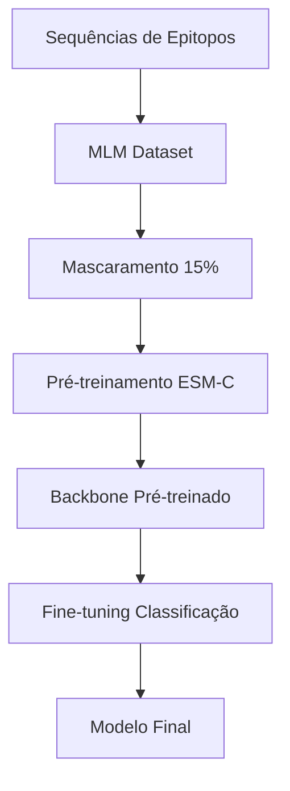

# 🧬 Pré-treinamento MLM para ESM-C em Epitopos

## 📖 Visão Geral

Este sistema implementa **Masked Language Modeling (MLM)** para pré-treinar modelos ESM-C especificamente em sequências de epitopos. O objetivo é adaptar o modelo, que foi originalmente treinado em sequências proteicas longas, para melhor compreender padrões em epitopos curtos.

### 🤔 Por que Pré-treinamento?

1. **Divergência de Domínio**: ESM-C foi treinado em proteínas longas, epitopos são sequências curtas (8-15 aminoácidos)
2. **Padrões Específicos**: Epitopos têm padrões estruturais e funcionais específicos
3. **Melhora de Performance**: Pré-treinamento pode melhorar convergência e performance final

## 🚀 Como Usar

### Opção 1: Pré-treinamento + Fine-tuning Automático

```bash
python main.py \
    --dataset MHC2 \
    --model esmc_300m \
    --pretrain \
    --pretrain-epochs 10 \
    --epochs 15
```

### Opção 2: Usar Backbone Já Pré-treinado

```bash
python main.py \
    --dataset MHC2 \
    --model esmc_300m \
    --pretrained-backbone-path ./MHC2/pretraining/pretrain_esmc_300m_20241218_143022/best_pretrained_esmc.pt \
    --epochs 15
```

### Opção 3: Apenas Pré-treinamento (Manual)

```python
from pretrainer import PretrainerESMC, load_sequences_from_files

# Carregar sequências
sequences = load_sequences_from_files("dados_pos.txt", "dados_neg.txt")

# Configurar pré-treinador
pretrainer = PretrainerESMC(
    sequences=sequences,
    artifacts_path="./artifacts",
    epochs=10,
    batch_size=16,
    max_length=256,
    base_model="esmc_300m"
)

# Executar
pretrained_path = pretrainer.run()
```

## ⚙️ Parâmetros de Pré-treinamento

### Argumentos Principais

| Parâmetro | Default | Descrição |
|-----------|---------|-----------|
| `--pretrain` | False | Habilita pré-treinamento MLM |
| `--pretrain-epochs` | 10 | Número de épocas de pré-treinamento |
| `--pretrain-lr` | 5e-5 | Learning rate para pré-treinamento |
| `--pretrain-batch-size` | 16 | Batch size para pré-treinamento |
| `--pretrain-max-length` | 512 | Comprimento máximo das sequências |
| `--mlm-probability` | 0.15 | Probabilidade de mascarar tokens |

### Configurações Recomendadas por Dataset

#### Dataset B (Células B)
```bash
--pretrain-max-length 256 \
--pretrain-batch-size 16 \
--pretrain-epochs 8
```

#### Dataset MHC1 (Epitopos MHC Classe I)
```bash
--pretrain-max-length 128 \
--pretrain-batch-size 32 \
--pretrain-epochs 10
```

#### Dataset MHC2 (Epitopos MHC Classe II)
```bash
--pretrain-max-length 256 \
--pretrain-batch-size 16 \
--pretrain-epochs 12
```

## 🧠 Como Funciona o MLM

### 1. Estratégia de Mascaramento

Para cada sequência de epitopo:
- **15%** dos aminoácidos são selecionados para mascaramento
- Destes 15%:
  - **80%** são substituídos por `<mask>`
  - **10%** são substituídos por aminoácido aleatório
  - **10%** permanecem inalterados

### 2. Exemplo Prático

```
Sequência original: FLKEKGGL
Sequência mascarada: F<mask>KEKGGL
Objetivo: Prever 'L' na posição mascarada
```

### 3. Tokens Válidos

Apenas aminoácidos são mascarados:
`A, R, N, D, C, Q, E, G, H, I, L, K, M, F, P, S, T, W, Y, V`

Tokens especiais (`<bos>`, `<eos>`, `<pad>`) nunca são mascarados.

## 📊 Estrutura de Arquivos

```
dataset/
├── pretraining/
│   └── pretrain_esmc_300m_20241218_143022/
│       ├── checkpoint_epoch_10.pt          # Checkpoint completo
│       ├── best_pretrained_esmc.pt         # Apenas backbone (para uso)
│       └── pretrained_esmc_epoch_10.pt     # Backbone da época específica
└── model/
    └── [runs de fine-tuning]
```

## 🔬 Monitoramento

### Weights & Biases

O pré-treinamento é automaticamente logado no W&B:

- **Projeto**: `esmc-pretrain-{dataset}`
- **Métricas**: MLM loss, learning rate, gradient norm
- **Frequência**: A cada 50 steps

### Métricas Importantes

1. **MLM Loss**: Deve diminuir consistentemente
2. **Learning Rate**: Cosine schedule com warmup
3. **Gradient Norm**: Para detectar gradient explosion

## 💡 Dicas de Otimização

### 🎯 Hiperparâmetros

1. **Learning Rate**:
   - Pré-treinamento: 1e-5 a 5e-5
   - Fine-tuning: Menor que pré-treinamento

2. **Batch Size**:
   - Epitopos curtos: 16-32
   - Epitopos longos: 8-16

3. **Épocas**:
   - Datasets pequenos: 5-10 épocas
   - Datasets grandes: 10-20 épocas

### 📈 Sinais de Sucesso

- [ ] MLM loss diminui consistentemente
- [ ] Não há overfitting (loss validation similar ao treino)
- [ ] Fine-tuning converge mais rápido
- [ ] Melhor F1 score final

### ⚠️ Problemas Comuns

#### 1. MLM Loss não diminui
- **Causa**: Learning rate muito alto
- **Solução**: Diminuir `--pretrain-lr`

#### 2. Out of Memory
- **Causa**: Batch size muito grande
- **Solução**: Diminuir `--pretrain-batch-size`

#### 3. Convergência lenta
- **Causa**: Learning rate muito baixo
- **Solução**: Aumentar `--pretrain-lr`

## 🔄 Fluxo Completo



## 📚 Referências

1. **BERT**: Devlin et al. "BERT: Pre-training of Deep Bidirectional Transformers"
2. **ESM**: Rives et al. "Biological structure and function emerge from scaling unsupervised learning"
3. **ESM-C**: Hayes et al. "Simulating 500 million years of evolution with a language model"

## 🐛 Troubleshooting

### Erro: "mask_token_id not found"
```python
# Verificar tokenizer
from models import get_tokenizer
tokenizer = get_tokenizer("esmc_300m")
print(f"Mask token ID: {getattr(tokenizer, 'mask_token_id', 'Not found')}")
```

### Erro: "Out of memory during pretraining"
```bash
# Reduzir batch size e max length
--pretrain-batch-size 8 \
--pretrain-max-length 128
```

### Erro: "No sequences loaded"
```bash
# Verificar arquivos de dados
ls -la dataset/train_positive.txt
ls -la dataset/train_negative.txt
```

---

## 📞 Suporte

Para problemas ou dúvidas:
1. Verifique este README
2. Execute `python exemplo_pretreinamento.py`
3. Consulte logs do W&B
4. Verifique implementação em `pretrainer.py` 